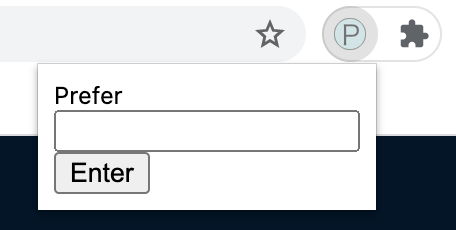

# proxy-for-stoplight-prism

proxy-for-stoplight-prism は Prefer ヘッダーを上書きするための Chrome 拡張です。
Stoplight Prism は HTTP リクエストの Prefer ヘッダーの値によって返すべきレスポンスを決定します。
このツールを利用することによって、Prefer ヘッダーを上書きるため、クライアントコードを修正することなく、Stoplight Prism モックサーバーから欲しいレスポンスを取得することが可能です。

# 制約

セキュリティ上の懸念から Chrome 拡張が動作可能なドメインを localhost に制限しています。
それ以外のドメインでは Prefer ヘッダーを上書きすることはできません。

# 利用方法

localhost の Web ページで本拡張を利用することが可能です。
「P」のアイコンをクリックすると Input フォームが表示されます。

このフォームに Prefer ヘッダーの値に設定したい文字列を入力し、Enter ボタンを押します。
以降のリクエストで Prefer ヘッダーが入力された値で上書きされます。
